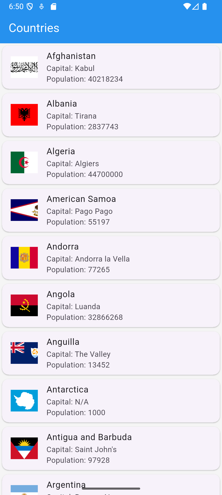

# Country Info App

A Flutter app that fetches and displays information about countries from the REST Countries API.
You can browse countries in alphabetical order, view their flags, capitals, and populations, and tap for more details.

---

## Features

- Fetches live data from REST Countries API
- Displays country name, flag, capital, and population 
- Pull-to-refresh support 
- Alphabetically sorted country list 
- Detail screen for each country

---

## Project Structure

lib/
│
├── main.dart                    # Entry point
├── models/
│   └── country.dart             # Data model
├── screens/
│   ├── country_list_screen.dart # Country List Screen
└── services/
    └── api_service.dart         # API connection

---

## Installation

1. Clone this repo:
    ```bash
   git clone https://github.com/Malaika-41158/Flutter-mobile-application/tree/main/Beginner/country_info_app
2. Navigate to project folder:
    ```bash
   cd country_info_app
3. Get dependencies:
    ```bash
   flutter pub get
4. Run the app:
    ```bash
   flutter run

---

## Screenshots




---

## Presented by
**Malaika, Software engineering Student**