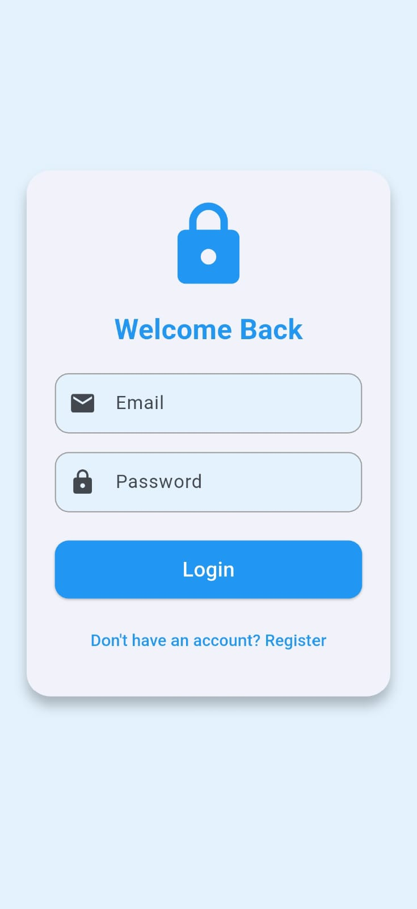
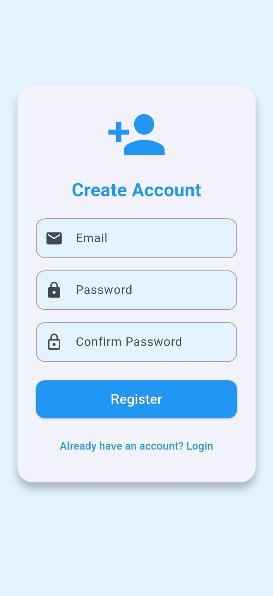
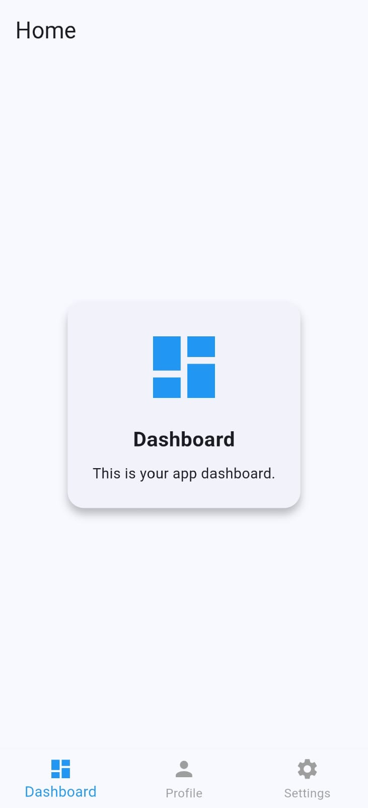

# Firebase Authentication (Demo)

A simple Flutter app demonstrating Firebase Authentication with login, registration, and logout functionality.

---

## Features

- User *Login* with email & password 
- User Registration with password confirmation 
- Persistent authentication state using Firebase
- Profile screen with email and avatar 
- Dashboard placeholder for future features 
- Settings with logout option 
- Light & Dark theme support

---

## Project Structure

lib/
│── main.dart                # Entry point
│── firebase_options.dart    # Firebase config
├── screens/
│   ├── login_screen.dart
│   ├── register_screen.dart
│   └── home_screen.dart

---

## Installation 

1. Clone this repo:
    ```bash
   git clone https://github.com/Malaika-41158/Flutter-mobile-application/tree/main/Beginner/firebase_authentication
2. Navigate to project folder:
    ```bash
   cd firebase_authentication
3. Get dependencies:
    ```bash
   flutter pub get
4. Run the app:
    ```bash
   flutter run

---

## Screenshots






---

## Presented by
**Malaika, Software engineering Student**