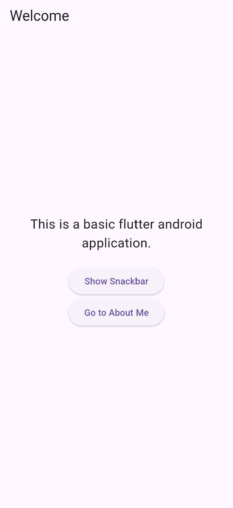
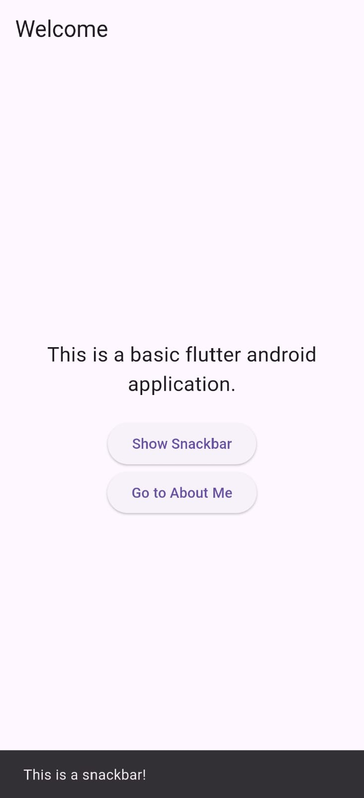
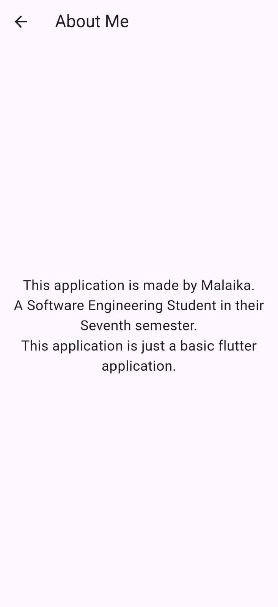

# My First Flutter App

## Description
A simple Flutter app with:
- Custom title and theme
- Button that shows a Snackbar
- Navigation to "About Me" screen

## Installation Steps

1. Clone the repo or extract ZIP
2. Run `flutter pub get`
3. Connect an Android device or start an emulator
4. Run: `flutter run`

## What I Changed

- Changed app title to **Malaika's Portfolio**
- Updated theme color to **cyan**
- Modified homepage title to **Welcome**
- Replaced default FAB with a **Snackbar button**
- Added a second screen: **About Me**
- Added **navigation** from home to About screen
- Used **hot reload**

## Screenshots 

## Demo Video
Open the `assets/demo.mp4` file to watch the full demo

---