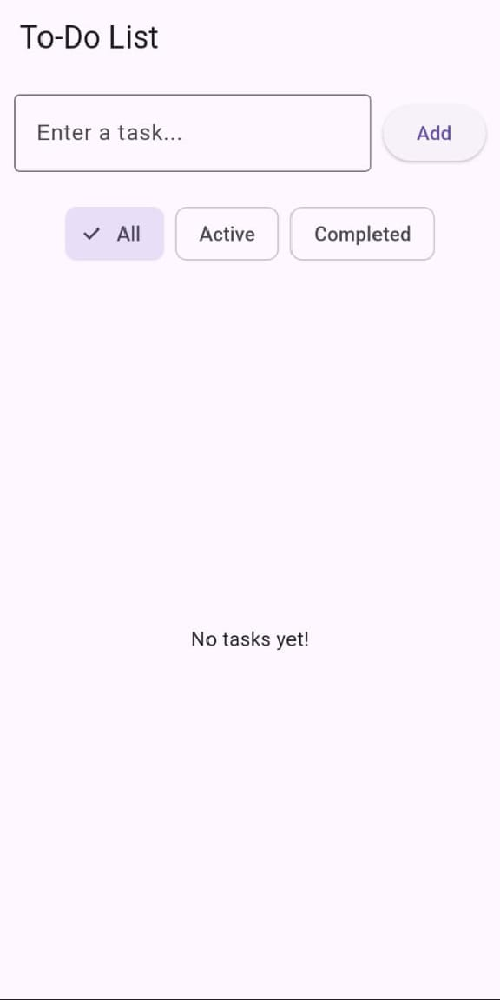

# To-Do List App (Using Shared Preference)

A simple To-Do List app built with Flutter, featuring task management with filtering and smooth animations.

---

## Features

- Add tasks using an input field and button.
- Remove tasks with a delete icon.
- Persistent storage using **SharedPreferences** (tasks remain after restart).
- Tasks displayed in a scrollable **ListView**.
- *(Bonus)* Mark tasks as completed and save their status.
- *(Bonus)* Basic color theme and clean UI.

---

## Project Structure

lib/
│── main.dart           # Entry point
│── models/
│   └── task.dart       # Task model
│── screens/
│   └── todo_home.dart  # Main screen with state management
│── widgets/
│   ├── task_input.dart # Input field & add button
│   └── task_item.dart  # Individual task UI

---

## Installation

1. Clone this repo:
    ```bash
   git clone https://github.com/Malaika-41158/Flutter-mobile-application/tree/main/Beginner/todo_list_sp
2. Navigate to project folder:
    ```bash
   cd todo_list_sp
3. Get dependencies:
    ```bash
   flutter pub get
4. Run the app:
    ```bash
   flutter run

---

## Screenshots

  


Note: The theme changes based on the theme of the device

---

## Presented by
**Malaika, Software engineering Student**