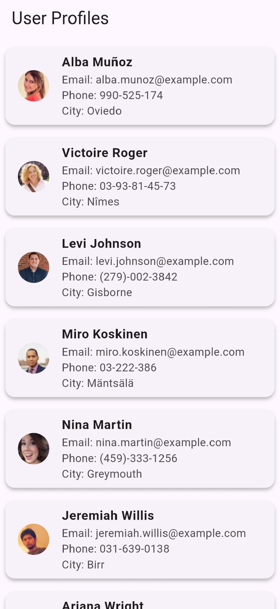

# User Profiles App 

A simple Flutter app that demonstrates how to integrate a REST API and display user profiles.  
The app fetches data from the [Random User API](https://randomuser.me/) and shows a list of users with their details.

---

## Features

- Fetches user profiles from `https://randomuser.me/api/`.
- Displays **name, email, phone, and profile picture**.
- Uses **FutureBuilder** for async data loading.
- Styled with **Card widgets** for a clean look.
- Shows a **loading spinner** while fetching data.
- Handles errors gracefully with an error message.
- 
---

## Project Structure

lib/
│── main.dart           # Entry point

---

## Installation

1. Clone this repo:
    ```bash
   git clone https://github.com/Malaika-41158/Flutter-mobile-application/tree/main/Beginner/user_profiles
2. Navigate to project folder:
    ```bash
   cd user_profiles
3. Get dependencies:
    ```bash
   flutter pub get
4. Run the app:
    ```bash
   flutter run

---

## Screenshots




---

## API reference

[Random User API Docs](https://randomuser.me/)

---

## Presented by
**Malaika, Software engineering Student**