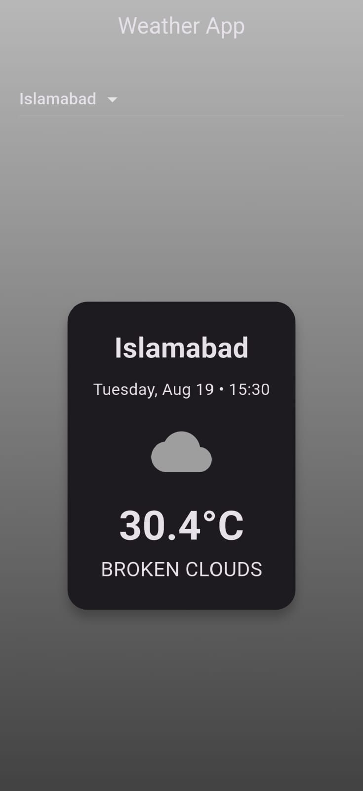

### Weather App

A simple weather app built with Flutter. It fetches live weather data from OpenWeatherMap API and displays:

- City name
- Current temperature
- Weather condition + icon
- Date & time

---

## Features

- Dropdown to switch cities
- Live weather data with http package
- Icons from OpenWeatherMap (fallback with weather_icons)
- Light/Dark theme support

---

## Packages Used

- http → API requests
- intl → Date & time formatting

---

## How to Run

1. Get an API key from OpenWeatherMap.
2. Replace it with the api key in main.dart.
3. Run the app:
    ```bash
    flutter pub get
    flutter run

---

## Screenshots




---

## Presented by
**Malaika, Software engineering Student**