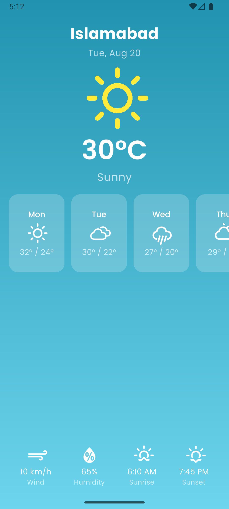

# Weather Forecast App

A visually appealing and responsive **Weather Forecast App UI** built with Flutter.  
This project focuses on **UI/UX design** and uses **dummy data** (no API integration yet).  
It’s designed to be scalable and easily extendable into a real weather app later.

---

## Features

- **Top Section**
    - Current location
    - Date
    - Weather icon
    - Temperature
    - Weather description (e.g., Sunny, Cloudy)

- **Mid Section**
    - Horizontal scroll of daily forecasts (5–7 days)
    - Each card shows: day name, icon, high/low temps

- **Bottom Section**
    - Additional weather info (wind speed, humidity, sunrise, sunset)

- **Design**
    - Gradient background
    - Custom fonts via `google_fonts`
    - Weather icons via `weather_icons`
    - Responsive layout for phones & tablets

---

## Screenshots




---

## Installation

1. Clone the repo:
   ```bash
   git clone https://github.com/Malaika-41158/Beginner/weather_forecast_app
   cd weather_forecast_app
2. Install dependencies:
    ```bash
   flutter pub get
3. Run on an emulator or device:
    ```bash
   flutter run
   
 ---

## Dependencies

- google_fonts -> custom fonts
- weather_icons -> weather icons
- cupertino_icons -> iOS-style icons

---

## Presented by

*Malaika, Software engineering Student*