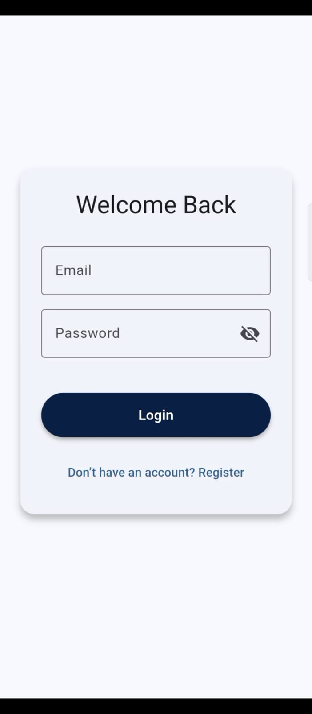
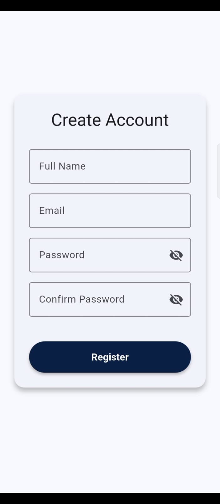
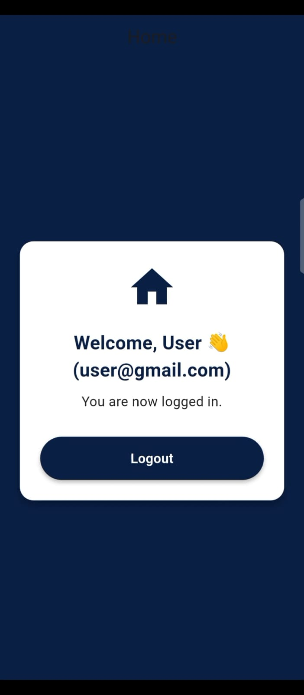

# Flutter Auth Demo

A simple Flutter authentication app that demonstrates login, registration, and logout flows using authentication provider, API request, and shared preference.

---

## Features

- Register with full name, email, password 
- Login with email and password 
- Persist user session (email and full name saved locally)
- Logout and clear session 
- Switch between mock auth and reqres.in API

---

## Project Structure

lib/
│── main.dart
├── providers/
│   └── auth_provider.dart   # Handles login, register, logout, persistence
├── screens/
│   ├── login_screen.dart    # Login UI
│   ├── register_screen.dart # Registration UI
│   └── home_screen.dart     # After logi
└── widgets/
    ├── custom_button.dart   # Reusable styled button
    └── input_field.dart     # Reusable styled text input with validation

---

## Authentication Setup

This project uses reqres.in fake API for demo authentication.

**Login**
Works with the test user:
Email: eve.holt@reqres.in  
Password: cityslicka

**Register**
Works with the test user:
Email: eve.holt@reqres.in  
Password: pistol

Note: The API does not actually save data, so registration won’t persist. We use SharedPreferences to store the user locally.

---

## Configuration

In auth_provider.dart, toggle between mock and API mode:
// true = use local mock validation
// false = use reqres.in API
final bool useMockApi = false;

---

## Installation

1. Clone this repo:
    ```bash
   git clone https://github.com/Malaika-41158/Flutter-mobile-application/tree/main/Intermediate/modular_authentication
2. Navigate to project folder:
    ```bash
   cd modular_authentication
3. Get dependencies:
    ```bash
   flutter pub get
4. Run the app:
    ```bash
   flutter run

---

## Screenshots






---

## Presented by
**Malaika, Software engineering Student**