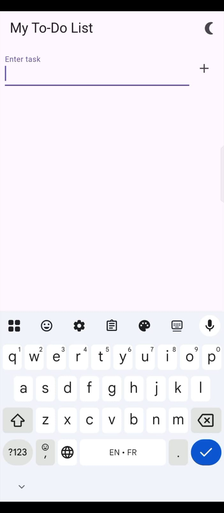
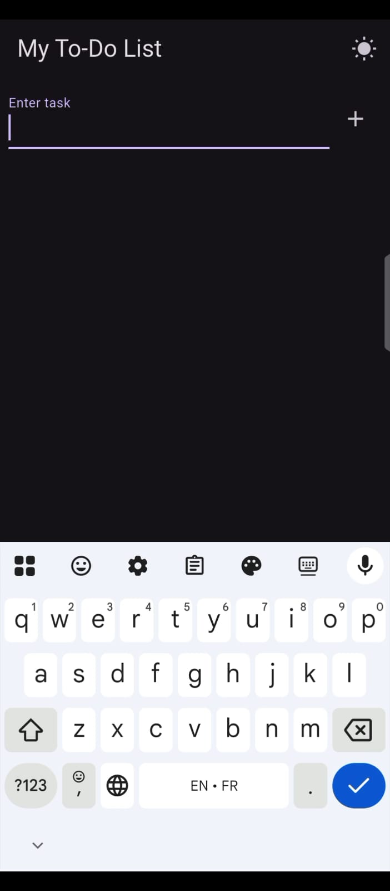

# Flutter To-Do List App

A simple and clean To-Do List app built with Flutter that lets users add, complete, edit, and delete tasks locally using Hive.

---

## How It Works

- Users can type and add tasks.
- Tasks are saved locally (offline) using Hive.
- Completed tasks are shown with a line-through.
- Tasks can be edited by long-pressing them.
- Tasks can be deleted with a trash icon.
- Theme toggle (light/dark) is available from the top-right of the app.

---

## Features Implemented

- Add new tasks
- Mark tasks as complete/incomplete
- Edit existing tasks
- Delete tasks
- Theme toggle (light and dark mode)
- Local data storage with Hive
- Clean and responsive UI

---

## How to Run

1. **Clone the project:**
   ```bash
   git clone (currently unavailable)
   cd <project_folder>
2. **Install dependencies:**
   ```bash
   flutter pub get
3. **Run the app**
   ```bash
   flutter run

---

## Dependencies Used

- hive – for local storage of tasks
- hive_flutter – for Flutter Hive support 
- path_provider – to get local app directory

---

## Screenshots/Demo





---

## Made by
*Malaika – Bachelors in Software Engineering*

---